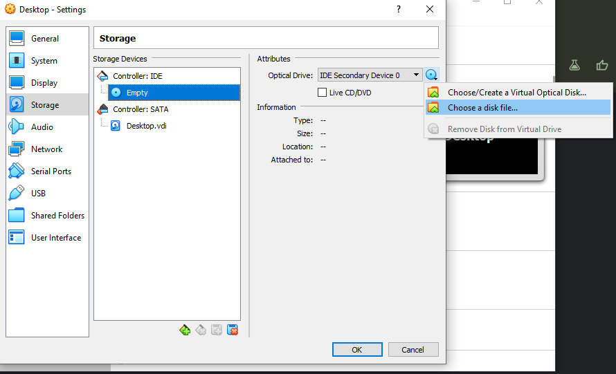
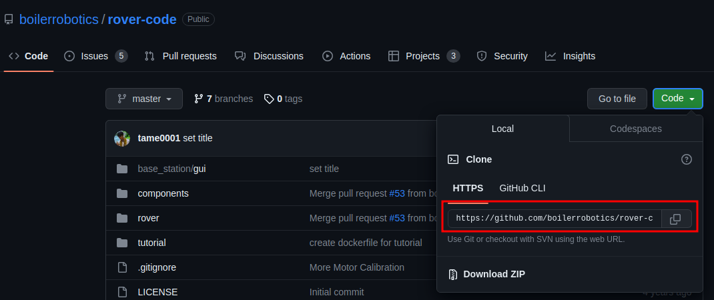

# Tutorial Module

## Install Software

Our core software framwork is Robot Operating System or [ROS](https://www.ros.org/).
There are legacy ROS which is no longer actively developed. T
he latest version (Noetic Ninjemys) will reach End of Life in May 2025.
Therefore, we will use ROS 2 instead.
The latest ROS 2 release is Iron Irwini (May 2023).
We will use ROS or ROS2 interchangeably and it will always refer to ROS Iron Irwini.
ROS can run on many operating systems but we highly recommend you to use it with Ubuntu.
We also highly recommend to create a virtual machine and install ROS on it.
Therefore, you will not mess up with your host machine.
The list below is software you need to install.

1. Virtual Machine. We will need to install Ubunto in the machine.
   The recommendation is [Virtual Box](https://www.virtualbox.org/).

2. [Ubuntu 22.04](https://ubuntu.com/download/desktop) (LTS - Long Term Support). This is a first tier support by ROS.

3. ROS Iron.

### Installation Guide

<ol>
<li> Create a new virtual machine. We recommend to set the machine spec as following

- Type: Linux
- Version: Ubuntu (64-bit)
- Memory: 4096 MB or more (Ff you local machine has less than 8GB of RAM, you may need to use lightweight Ubuntu instead)
- Virtual Hard Drive: 25 GB or more (You will create a Dynamic VirtualBox Disk Image. It will take the actual space the VM use but not more than 25GB or at the capaticy you allow it to use)

<li> Mount the Ubuntu ISO that you download by clicking settings -> Stoage. Click on CD drive icon then choose the disk file.



<li> Start the machine. You will follow the installation instruction. 
Along the process, you will be a admin of this virtual machine. 
The password that you choose for it is important. 
If you forget the password, there is no way to recover it. 
You will need this password to install software packages later.

<li> Follow this tutorial to install ROS: https://docs.ros.org/en/iron/Installation/Ubuntu-Install-Debians.html

<li> You can choose either (but not both) `desktop` or `base`. 
The base version has everything we are using right now. 
The desktop version has tools that could be benefitial but we don't use it often. 
If you choose to install the base version, keep in mind that you might not be able to run some commands.

<li> At the end, run the following command, it will add a script to activate ROS everytime you open the new terminal.

```bash
echo "source /opt/ros/iron/setup.bash" >> ~/.bashrc
```

</ol>

### Visual Studio Code and GitHub

We recommend using [Visual Studio Code ](https://code.visualstudio.com/)(VS Code) for writing code.
It comes with extensions that will make coding much easier.
You will need to install [Git](https://git-scm.com/).
For Ubuntu, run the following command to on the terminal

```bash
sudo apt install git
```

Now, you have everything ready to clone the source code and start editing.
You have two options to clone the source code: command or VS Code.
This tutorial will only cover the VS Code option.
First, copy the source code URL from GitHub.


On the VS Code, click View -> Command Pallete (Ctrl + Shift + P) then type "git: clone".


VS Code will ask for the URL.


Select the location that you want to keep the source code. Then you have a source code in your local machine.
